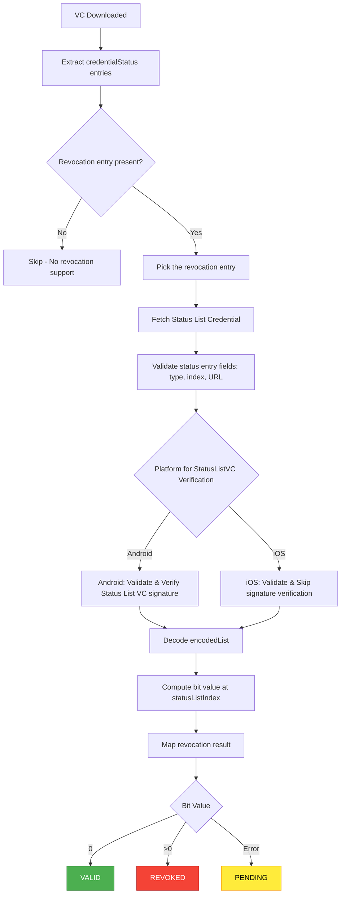

# Revocation Check — Inji Wallet

This document explains how Inji Wallet determines whether a credential is valid, revoked, or in a pending/unknown state.

Revocation is based on the [**Status List 2021**](https://www.w3.org/TR/vc-bitstring-status-list/) mechanism. The wallet currently supports only `statusPurpose = "revocation"`. Additionally, the wallet only supports status check of credentials in the `ldp_vc` format. For other formats status check is bypassed for now.

---

## Flow Diagram (End-to-End)



---

## Step-By-Step Explanation

**The steps described below take place in the respective native modules of Android [VC verifier library](https://github.com/mosip/vc-verifier/tree/master/vc-verifier/kotlin)  and iOS (embedded in iOS module within wallet)**

### 1. VC Downloaded
As soon as the credential is downloaded in the wallet, the status checking process begins automatically.

### 2. Extract `credentialStatus` Entries
The wallet reads the `credentialStatus` field from the credential and filters entries where:

```
statusPurpose == "revocation"
```

- Only the `revocation` purpose is currently supported
- If no matching entry is found → revocation check is skipped
- If multiple entries exist, the wallet picks the one with matching purpose

### 3. Fetch Status List Credential
From the selected `credentialStatus` entry, the wallet extracts:

```js
{
  "statusListCredential": "https://issuer.example.com/status/...",
  "statusListIndex": 1 // integer: default is 1,
  "statusSize": 1 // integer: default is 1
}
```

The wallet (on both platforms) triggers an HTTP GET request to download the Status List VC from the `statusListCredential` URL.

### 4. Processing Steps

The wallet performs comprehensive validation:

- **Entry structure validation** — verifies type, index, and URL format
- **Status List VC metadata validation** — checks credential structure
- **Validity window verification** — validates `validFrom` and `validUntil` timestamps
- **Signature verification** — verifies the Status List VC signature (**this is skipped in ios for now**)
- **Decoding** — reads and decodes the `encodedList` (base64url + gzip)
- **Bit extraction** — computes the bit value at `statusListIndex`
- **Returns** — final revocation status result


### 5. Interpreting the Result

After computing the status bit from the encoded list:

| `statusValue` | Meaning | Wallet Final State |
|---------------|---------|-------------------|
| `0` | Credential is valid | **VALID** |
| `>0` | Credential is revoked | **REVOKED** |
| Exception / network error / malformed data | Could not determine status | **PENDING** |

### 6. Final Wallet States

#### VALID ✓
- `statusValue = 0`
- No errors during processing
- Credential can be used normally

#### REVOKED ✗
- `statusValue > 0`
- No errors during processing
- Credential should not be used

#### PENDING ⏳
The credential status could not be determined due to:

- Network failure or timeout
- Invalid or unreachable status list URL
- Invalid credential structure
- Failed to decode `encodedList`
- Signature verification failure (Android only)
- Malformed Status List VC
- Any other exception during processing

The wallet UI displays this state as **"Status Pending"**.

---

## Additional Notes

- **Purpose support:** Only `revocation` is currently supported. Future expansion may include `suspension` or other purposes as defined in the Status List 2021 specification.

- **Multi-bit status:** Credentials with `statusSize > 1` are supported (0 = valid, >0 = revoked).

- **iOS signature verification:** Full signature verification of the Status List VC will be added to the iOS library in a future update. Currently, this step is bypassed.

- **Status recheck:** Status checks are performed when the credential is first downloaded and can be triggered manually by the user.

- **Offline behavior:** If the wallet is offline, credentials will show as PENDING until connectivity is restored and the status can be verified.

---

## References

- [W3C Status List 2021](https://www.w3.org/TR/vc-bitstring-status-list/)
- Inji Wallet Documentation
